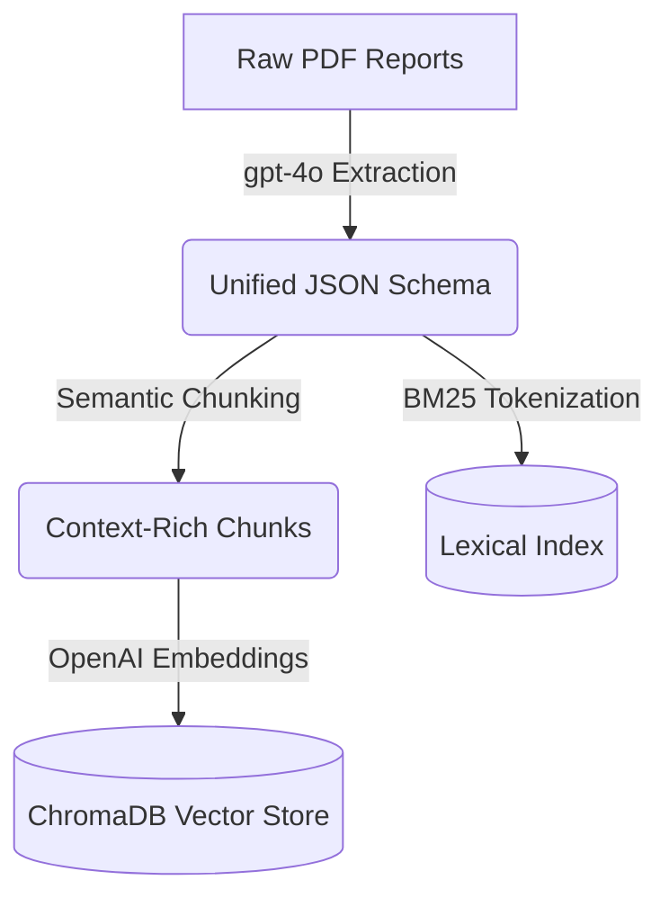
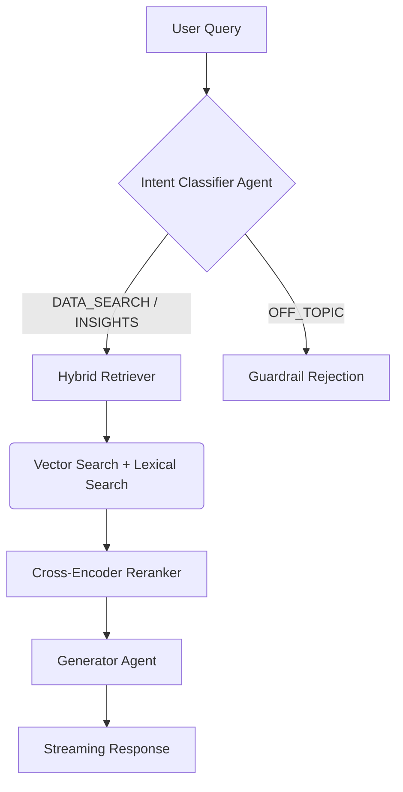
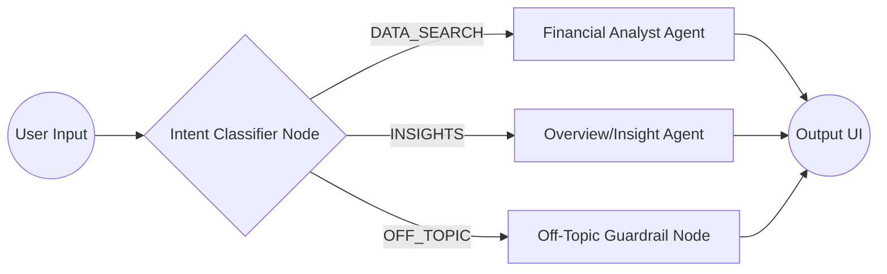

# Financial RAG Agent 📊

An advanced Agentic Retrieval-Augmented Generation (RAG) system specifically built to process, analyze, and query highly complex Indonesian Financial Reports (e.g., Laporan Neraca, Laba Rugi, Komitmen & Kontinjensi). 

This project bridges the gap between raw, unstructured multi-page financial PDFs and precise, hallucinaton-free numerical retrieval using state-of-the-art LLMs and hybrid search architectures.

---

## 1. About This Project
Extracting financial data from banking publication reports often suffers from attention dilution, especially when reports span multiple pages or mix different reporting standards. 

This project solves that by:
- Utilizing **Vision LLMs** (`gpt-4o`) to intelligently parse complex, multi-page tabular data into a highly structured, unified JSON schema.
- Creating a robust **Hybrid RAG Pipeline** capable of discerning exact numerical queries (e.g., "What is the Total Liabilities of Bank BCA per 30 Nov 2024?") vs. open-ended insight queries without hallucinating totals from sub-items.
- Using an **Agentic Graph Workflow** to intelligently route user intents to specialized tools.

## 2. Tech Stack
- **Core Orchestration**: [Google ADK](https://github.com/google/adk) (Agent Graph)
- **Large Language Models**: `gpt-4o` (Dense Data Extraction), `gpt-4o-mini` via LiteLLM (Intent Classification & Synthesis).
- **Vector & Storage**: ChromaDB
- **Retrieval Engine**: BM25s (Lexical) + Vector Search = **Hybrid Search** with Reranking.
- **Data Validation**: Pydantic
- **Observability**: LangSmith
- **Frontend**: Streamlit (Multi-Page Architecture)

## 3. High-Level Project Flow
The system operates in two main phases: Ingestion and Retrieval.

### Phase A: Ingestion (Data Processing)

**Ingestion Flow:**


1. **Extraction**: Raw PDFs are fed directly to `gpt-4o`. The model maps multi-page tables into a nested `FinancialDocument` Pydantic schema, successfully differentiating multi-page assets, liabilities, and equity into singular unified reports.
2. **Chunking**: The JSON is broken down into semantically rich chunks (e.g., `overview`, `report_total`, `category_total`, and specific `items`).
3. **Embedding**: Chunks are embedded via `text-embedding-3-small` and stored in ChromaDB.

### Phase B: Agentic Retrieval (Querying)

**RAG Pipeline Flow:**


**Graph Architecture:**


1. **Intent Classification & Guardrails**: A routing agent evaluates the user query and routes it.
2. **Hybrid Retrieval**: Combines Chroma's semantic vector search with BM25s lexical search to capture both context and exact keyword matches (like specific account names).
3. **Reranking & Synthesis**: Results are reranked via `CrossEncoder`, then fed to the selected specialized agent to stream a precise, grounded answer back to the UI.

## 4. Schema Example
To ensure the LLM doesn't skip data, the target schema supports multiple reports inside a single document:

```json
{
  "company_name": "PT BANK CENTRAL ASIA Tbk",
  "period_date": "30 Nov 2024",
  "reports": [
    {
      "report_title": "LAPORAN POSISI KEUANGAN (NERACA)",
      "categories": [
        {
          "category_name": "LIABILITAS",
          "items": [
            { "item_name": "Giro", "item_value": 363089972.0 },
            { "item_name": "Tabungan", "item_value": 551762620.0 }
          ],
          "category_total": 1166218740.0
        }
      ],
      "report_total": 1415407416.0
    }
  ]
}
```

## 5. Evaluation Result
The system is heavily evaluated against strict Ground Truth tests to ensure **0% hallucination** on numerical data. 

In our latest automated benchmark using `src/utils/evaluate.py`:
- **Retrieval Accuracy**: **100% (11/11)**
- **Answer Exact Match**: **100% (11/11)**
- The LLM consistently matches the exact numerical strings requested for complex queries across multiple reports (Balance Sheet, Income Statement, Commitments & Contingencies) and automatically rejects out-of-domain prompts.

## 6. How To Run

### Prerequisites
Make sure you have `uv` installed, then install dependencies:
```bash
uv pip sync requirements.txt
```

Set up your `.env` file with your `OPENAI_API_KEY`.

### Running the Pipeline
**1. Extract and Index Data:**
Convert PDFs in `data/raw/` into processed JSONs and store them in ChromaDB.
```bash
python src/rag/process_pipeline.py
```

**2. Run Automated Evaluation:**
Validate the integrity of the RAG system against your test suite.
```bash
python src/utils/evaluate.py
```

**3. Start the Agentic UI:**
Launch the Streamlit interface to chat with the financial agent.
```bash
streamlit run main.py
```

**4. View Observability Traces:**
Make sure `LANGCHAIN_TRACING_V2=true` and `LANGCHAIN_API_KEY` are set in your `.env`. You can then view the full trace of LLM calls, latency, and tokens on the [LangSmith Dashboard](https://smith.langchain.com/).

## 7. Codebase Walkthrough (For Developers)

Here is a quick map of the repository to help you navigate and extend the system:

- **`main.py`**: The Streamlit multi-page entry point. Handles the UI routing between the EDA Dashboard and the Chat Assistant.
- **`src/agents/agents.py`**: Defines the Google ADK Agent Graph. Contains the Intent Classifier and routing logic (Guardrails, Data Search, Insights).
- **`src/experiments/eda.py`**: Contains the Exploratory Data Analysis script and Streamlit rendering logic for the Business Insights dashboard.
- **`src/models/report.py`**: The Pydantic schema definition (`FinancialDocument`) used to enforce structured JSON extraction from PDFs.
- **`src/rag/`**: The core of the RAG pipeline.
  - `process_pipeline.py`: Orchestrates the entire ingestion process (PDF -> JSON -> ChromaDB).
  - `ingestion.py`: Uses `gpt-4o` to extract data from PDFs into the Pydantic schema.
  - `chunking.py`: Breaks down the structured JSON into semantically rich text chunks.
  - `embedding.py`: Manages the ChromaDB client and OpenAI embedding functions.
  - `hybrid_search.py`: Implements the dual-retrieval system (Vector + BM25 Lexical).
  - `reranker.py`: Employs a HuggingFace `CrossEncoder` to re-score and rerank retrieved documents with `@st.cache_resource` memory optimization.
  - `retriever.py`: Bridges the agent queries to the hybrid search and reranker pipeline.
- **`src/utils/evaluate.py`**: Automated testing script to validate the system's accuracy against Ground Truth datasets.

## 8. Future Improvements

- **Integration with Multi-Agent Setup**: Connecting this RAG agent to other specialized agents (e.g., General Chatbot, HR, IT) via a master orchestrator.
- **Automated Ingestion Watcher**: Creating a background worker or Celery task that automatically monitors the `data/raw/` directory and ingests new PDFs dynamically.
- **Multi-Year Comparative Analysis**: Expanding the EDA Dashboard to support comparative Year-over-Year (YoY) charts over a longer timeframe.
